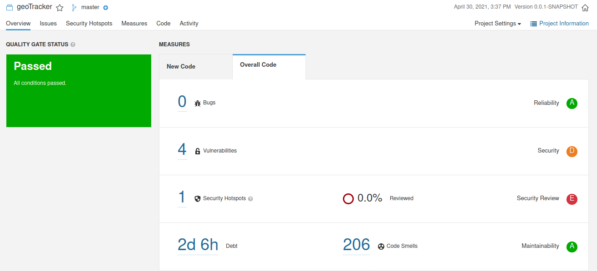
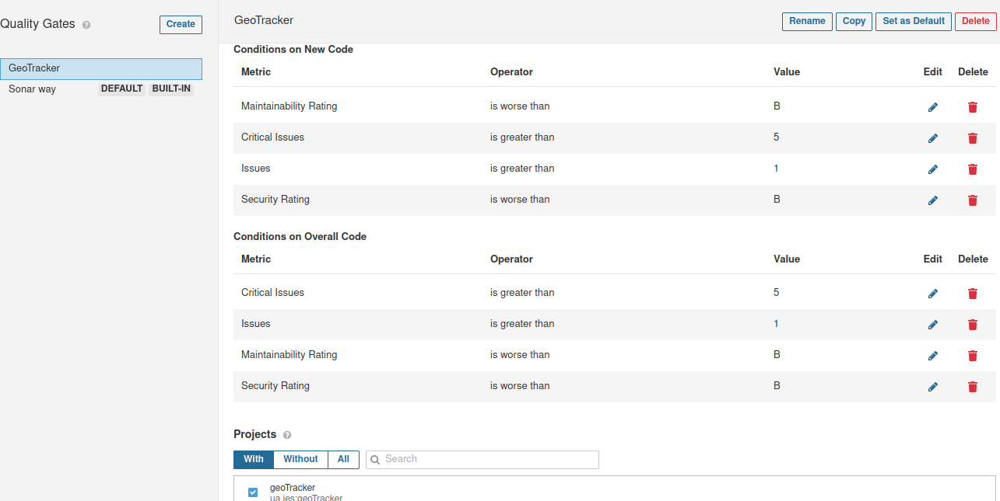
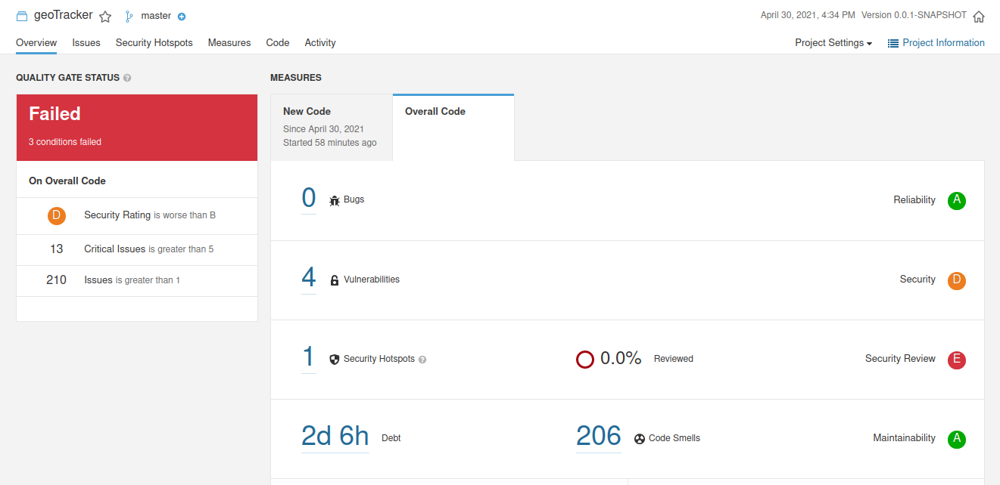

# Part1

| ISSUE              | Problem Description  | How To Solve  |
| ------------------ |:--------------------:| -------------:|
| Bug |Save and Reuse this "Random" | Remove initialization from inside the function and change to SecureRandom.getInstanceStrong() |
| Code Smell (Major) | Replace this use of System.out or System.err by a logger. (x7) | Use logger in order to save the results in a standardized form |
| Code Smeel (Minor) | Reorder the modifiers to comply with the Java Language Specification. | Reorder modifiers since public should come before static |
| Code Smell (Minor) | The return type of this method should be an interface such as "List" rather than the implementation "ArrayList". | Switch the return from ArrayList (class) to List (interface) |
| Code Smell (Minor) | Replace the type specification in this constructor call with the diamond operator ("<>"). | Remove Dip from diamond operator to reduce verbosity. |
| Code Smell (Minor) | Use isEmpty() to check whether the collection is empty or not. | Comparison is being made through the length of the collection and should be changed to isEmpty() |

e)\
It did not pass the predefined quality gate since two classes did not have more than 80% coverage from tests. Regarding the class SetOfNaturals the coverage was 80% and it did not pass the threshold due to a branch in a function not being tested and due to functions that are overridden, therefore, not tested. The other file that leads to this was DemoMain which was not tested at all, which means that the coverage was 0%.

## Part2
a)\
Technical debt is 2h15m. Technical debt is the amount of time needed in order to "fix all mistakes" according to the sonarqube analysis.

b)\
Changes to euromillions were pushed in lab1.

c)\
Uncovered lines: 41\
Uncovered Conditions: 12

## Part3

a) 
With the default test, the project passed even though the stats were not that good.

After doing so, I created a Quality Gate but only with metrics on New Code and since I did not change any of it, it passed again.

Finally, I changed the Quality Gate to have the same stats from New Code to the Whole Project.

Since at the day of the development of the project we did not have a good notion on how to perform tests we did not do it at all, so in this Quality gate it would not make sense to test on it and because the project deals with user location it should be farly secure so I came up with the B rating as the threshold for it to pass. Due to these reasons I came up with this Quality Gate.

With this Quality Gate selected, as expected the test failed, since there are a lot of code smells, the security rating was higher than B (it was D) and there were 13 critical issues as opposed to the maximum to pass, which was 5 critical issues.

